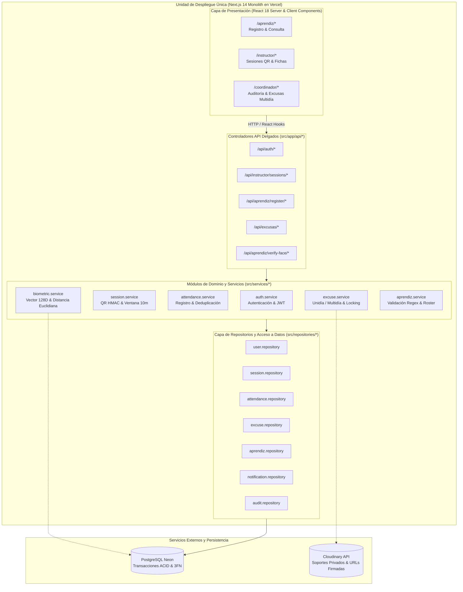

# 05 — Arquitectura de Monolito Modular (Modular Monolith)
## Sistema de Gestión de Asistencia SENA

El Sistema de Asistencia SENA se concibe y despliega como un **Monolito Modular** construido sobre Next.js 14 (App Router) y TypeScript, desplegado como una unidad cohesiva en Vercel con persistencia relacional en PostgreSQL (Neon).

---

## 1. Topología del Monolito Modular SENA

---

## 2. Definición de Módulos Acotados (Bounded Contexts)

| Módulo | Responsabilidad de Dominio | Entidades Principales | Acceso a Base de Datos |
|---|---|---|---|
| **`auth`** | Gestión de credenciales institucionales, generación y validación de tokens JWT sin estado (12h de vigencia). | `users` | `user.repository.ts` |
| **`aprendiz`** | Gestión de aprendices por ficha, control de estado (activo/retirado), catálogo de motivos de retiro y enrolamiento biométrico. | `aprendices`, `fichas` | `aprendiz.repository.ts`, `ficha.repository.ts` |
| **`biometric`** | Comparación vectorial 128D Float32 en memoria, validación de umbral de similitud (0.55) y mitigación de suplantación. | `aprendices.face_descriptor_json` | `biometric.service.ts` |
| **`session`** | Generación de sesiones de clase, cálculo de tokens QR rotativos HMAC-SHA256 (30s) y límite estricto de reapertura extemporánea (10 min). | `qr_sessions`, `ambientes` | `session.repository.ts` |
| **`attendance`** | Marcación de presencia, validación de ventanas temporales, deduplicación de registros e histórico por instructor. | `attendances` | `attendance.repository.ts` |
| **`excuse`** | Radicación de excusas con ficha obligatoria, enrutamiento condicional (Unidía -> Instructor / Multidía -> Coordinador), bloqueo optimista (`version`) y expedición de URLs firmadas Cloudinary. | `excuse_requests`, `notifications`, `audit_events` | `excuse.repository.ts`, `notification.repository.ts` |

---

## 3. Principios y Reglas de la Arquitectura en Capas

1. **Inversión de Dependencias y Separación de Capas:**
   - La capa de **Presentación** (`src/app/`) nunca se comunica directamente con la base de datos PostgreSQL (`pg`). Consume exclusivamente endpoints de la capa de **Controladores** (`src/app/api/`).
   - Los **Controladores** son delgados: validan sintaxis/parseo HTTP, invocan a la capa de **Servicios** y mapean códigos HTTP (200, 201, 400, 401, 403, 404, 409, 500).
   - Los **Servicios** (`src/services/`) encapsulan la totalidad de las reglas de negocio, cálculos de seguridad criptográfica y validación con Zod.
   - Los **Repositorios** (`src/repositories/`) centralizan las sentencias SQL parametrizadas (`$1, $2...`) y el manejo de transacciones atómicas (`BEGIN ... COMMIT ... ROLLBACK`).
   - El **Dominio** (`src/domain/`) contiene modelos TypeScript puros, esquemas Zod de entrada y constantes de negocio inmutables, sin dependencias de infraestructura.

2. **Cero "Puertas Abiertas":**
   - No se permiten sentencias `TODO` o bypasses de validación en rutas de producción. Toda entrada se somete a esquemas Zod rigurosos.

3. **Comunicación In-Process:**
   - Entre servicios no existen llamadas de red intermedias; son invocaciones TypeScript directas y fuertemente tipadas en el mismo proceso de Node.js en Vercel.

4. **Persistencia Centralizada y Consistencia Transaccional:**
   - Una única base de datos PostgreSQL en Neon con modelo normalizado en Tercera Forma Normal (3FN), garantizando integridad referencial mediante claves foráneas y control de concurrencia optimista (`version`).
