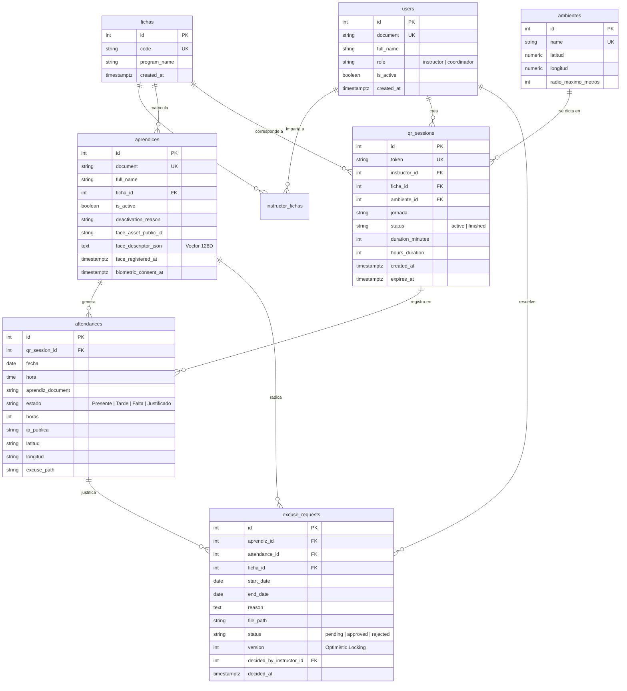

# 06 — Modelos de Datos y Persistencia (Data Models)
## Sistema de Gestión de Asistencia SENA

Este documento formaliza el esquema relacional en **Tercera Forma Normal (3FN)** implementado en PostgreSQL (Neon Serverless) y la estrategia de persistencia del vector biométrico facial (`FLOAT8[]` / JSON 128D).

---

## 1. Entidades en Tercera Forma Normal (3FN)

El modelo de datos cumple rigurosamente con los preceptos de 3FN:
1. **1FN (Primera Forma Normal):** Todos los atributos son atómicos; no existen grupos repetitivos.
2. **2FN (Segunda Forma Normal):** Se encuentra en 1FN y cada atributo no clave depende funcionalmente de la totalidad de la clave primaria (sin dependencias parciales).
3. **3FN (Tercera Forma Normal):** Se encuentra en 2FN y no existen dependencias transitivas (ningún atributo no clave depende de otro atributo no clave).

| Entidad | Tabla | Módulo Propietario | Clave Primaria | Claves Foráneas | Responsabilidad |
|---|---|---|---|---|---|
| **Usuario** | `users` | `auth` | `id` | - | Instructores y Coordinadores del sistema. |
| **Ficha** | `fichas` | `aprendiz` | `id` | - | Grupos de formación titulada o complementaria. |
| **Ambiente** | `ambientes` | `session` | `id` | - | Aulas, talleres y laboratorios de aprendizaje. |
| **Instructor-Ficha** | `instructor_fichas`| `session` | `(instructor_id, ficha_id)` | `instructor_id` -> `users.id`, `ficha_id` -> `fichas.id` | Asignación M:N de fichas a instructores. |
| **Sesión QR** | `qr_sessions` | `session` | `id` | `instructor_id` -> `users.id`, `ficha_id` -> `fichas.id`, `ambiente_id` -> `ambientes.id` | Ventana temporal activa de asistencia (5 min base, 10 min extemporáneo). |
| **Aprendiz** | `aprendices` | `aprendiz` | `id` | `ficha_id` -> `fichas.id` | Aprendices matriculados y registro biométrico. |
| **Asistencia** | `attendances` | `attendance` | `id` | `qr_session_id` -> `qr_sessions.id`, `aprendiz_id` -> `aprendices.id` | Registro inmutable de presencia/tardanza/falta. |
| **Excusa** | `excuse_requests`| `excuse` | `id` | `aprendiz_id` -> `aprendices.id`, `attendance_id` -> `attendances.id`, `decided_by_instructor_id` -> `users.id` | Justificaciones unidía/multidía con bloqueo optimista. |
| **Notificación** | `notifications` | `excuse` | `id` | - | Alertas dirigidas a aprendices o instructores. |
| **Auditoría** | `audit_events` | `audit` | `id` | - | Trazabilidad inmutable de acciones críticas. |

---

## 2. Diagrama Entidad-Relación (ER)



---

## 3. Persistencia y Optimización del Vector Biométrico Facial

### El Descriptor 128D (Face Embedding)
La red neuronal (`@vladmandic/face-api`) proyecta cada rostro en un hiperespacio de 128 dimensiones reales normalizadas ($\|v\|_2 = 1$).

### Estrategia de Persistencia Dual (`FLOAT8[]` / JSON)
1. **Columna `face_descriptor_json` (TEXT):**
   - Serialización canónica en formato JSON Array `[0.0421, -0.1284, ..., 0.0891]` compatible con cualquier driver estándar y clientes web.
2. **Representación Vectorial `FLOAT8[]` (PostgreSQL Nativo):**
   - En PostgreSQL, los arreglos de punto flotante de 64 bits (`FLOAT8[]`) permiten operaciones vectoriales directas en SQL mediante extensiones o cálculo nativo.
3. **Comparación en Memoria (< 200 ms):**
   - Para evitar latencia de red y sobrecarga de CPU en la base de datos serverless, el descriptor de referencia se carga en memoria y la comparación se ejecuta en la capa de servicios (`biometric.service.ts`):
   $$\text{Distancia}(u, v) = \sqrt{\sum_{i=0}^{127} (u_i - v_i)^2}$$
   - Si la distancia euclidiana es $\le 0.55$, la verificación es exitosa.

---

## 4. Control de Concurrencia Optimista (Optimistic Locking)

En la tabla `excuse_requests`, el atributo `version INT NOT NULL DEFAULT 1` previene condiciones de carrera cuando un instructor y un coordinador intentan calificar la misma solicitud simultáneamente:

```sql
UPDATE excuse_requests
SET status = $1,
    instructor_comment = $2,
    decided_by_instructor_id = $3,
    decided_at = NOW(),
    version = version + 1
WHERE id = $4 AND version = $5 AND status = 'pending';
```

Si otra transacción modificó la fila previamente, `UPDATE` afecta 0 filas, lo que dispara una excepción `ConcurrencyConflictError` mapeada a `HTTP 409 Conflict`.
